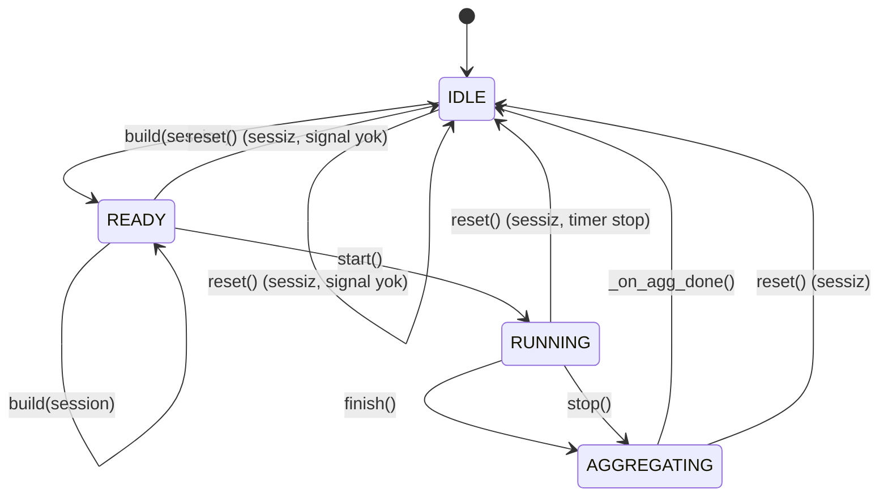

# SessionStateMachine Durum Geçişleri

Kaynak: `bench_test/measurement/state_machine.py`

## Kısa Notlar

- Geçersiz state çağrılarında geçiş yapılmaz; sadece `log_signal` ile uyarı loglanır.
- `RUNNING` durumunda `QTimer`, `AGGREGATE_INTERVAL_MS` aralığında periyodik aggregate çalıştırır.
- `finish()` ve `stop()` sonrası tek seferlik final aggregate çalışır, ardından `IDLE` durumuna dönülür.
- `state_changed` sinyali yalnızca `_transition()` çağrılarında emit edilir; `reset()` bunu bilerek emit etmez.

